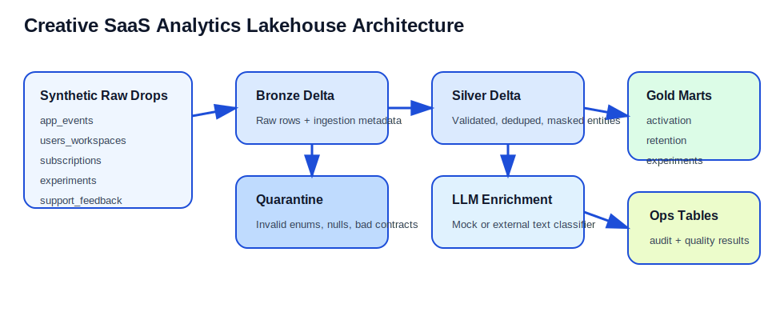
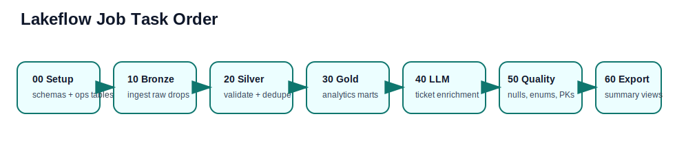
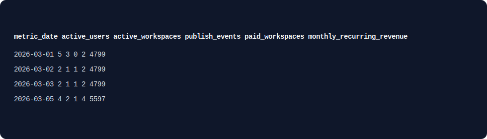
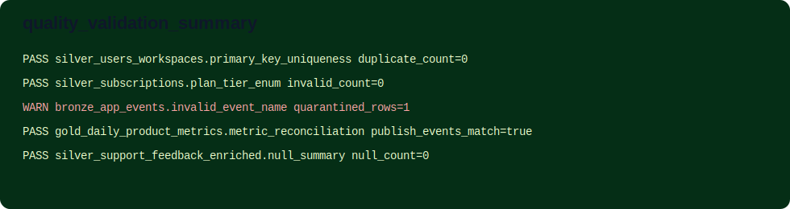

# SaaS Analytics Lakehouse

This repository presents a production-style analytics lakehouse for a collaborative creative SaaS platform. It is designed around the needs of product, growth, support, and leadership teams: ingest product events, workspace metadata, subscriptions, experiments, and support feedback, then publish trusted analytics-ready tables for activation, adoption, retention, experiment performance, and support topic trends.

The implementation is intentionally sized to run in Databricks Free Edition, but the engineering patterns mirror a real internal data platform: bronze/silver/gold layering, idempotent Delta-style loading, schema contracts, audit logging, quarantine handling, metric reconciliation, and a lightweight structured + unstructured enrichment workflow.

## Business Story
The platform models an internal analytics system for a creative software company. It ingests user activity, workspace metadata, subscriptions, experiment assignments, and support feedback. The pipeline builds bronze, silver, and gold layers that answer:

- how users activate into product value
- which features drive adoption
- how workspace retention trends evolve
- which experiment variants convert better
- what support topics are trending and how an LLM-style classifier can enrich text feedback

## What This Signals
- `Databricks + Spark + Python + SQL`: notebook orchestration, Spark-style transforms, SQL-heavy gold models
- `Delta + idempotency`: `MERGE`-driven rerun safety for silver and gold
- `Data quality + governance`: schema contracts, validation, quarantine logic, audit tables, metric reconciliation
- `Product analytics depth`: activation, retention, adoption, experiment readouts
- `LLM exposure`: deterministic mock classifier plus a pluggable external provider interface

## Architecture


## Job DAG


## Expected Output Snapshots



## Repo Layout
```text
saas-analytics-lakehouse/
  README.md
  docs/
  conf/
  data/
  notebooks/
  src/
  tests/
  ops/
```

## Stable Interfaces
- `conf/project_config.yml`: runtime defaults, layer names, table names, feature flags
- `conf/schemas/*.yml`: raw source contracts, primary keys, required fields, enums, and PII markers
- `src/creative_analytics_platform/llm.py`: `classify_and_summarize(text, context) -> {topic, summary, sentiment, confidence}`
- gold tables:
  - `gold_daily_product_metrics`
  - `gold_activation_funnel`
  - `gold_feature_adoption`
  - `gold_workspace_retention`
  - `gold_experiment_readout`
  - `gold_support_topic_trends`
- `ops/job_definition.yml`: Lakeflow Job definition for notebook orchestration

## Run Order In Databricks Free Edition
1. Import this repo into a Databricks Repo or workspace files area.
2. Open `notebooks/00_setup_workspace.py` and run it once.
3. Run the Lakeflow Job described in `ops/job_definition.yml`, or execute the notebooks in order:
   - `00_setup_workspace.py`
   - `10_bronze_ingestion.py`
   - `20_silver_transforms.py`
   - `30_gold_metrics.py`
   - `40_llm_enrichment.py`
   - `50_quality_validation.py`
   - `60_export_summary.py`
4. Change the `batch_id` widget to simulate reruns, incrementals, and late arrivals.

## Local Development
The config and schema files use JSON-compatible YAML so they can be loaded with the Python standard library.

Run local tests:

```bash
python3 -m unittest discover -s tests
```

Optional local package install:

```bash
python3 -m pip install -e .
```

## Synthetic Data Drops
- `data/raw/2026-03-01`: initial seed load
- `data/raw/2026-03-05`: incremental updates, plan upgrades, duplicate events, and one invalid event
- `data/raw/2026-03-07_late_arrivals`: late-arriving events plus a support ticket correction

## Gold Tables
| Table | Grain | What it shows |
|---|---|---|
| `gold_daily_product_metrics` | `metric_date` | Daily actives, publish volume, paid workspace count |
| `gold_activation_funnel` | `metric_date` | Funnel stages from signup to publish |
| `gold_feature_adoption` | `metric_date, event_name` | Feature usage and unique users/workspaces |
| `gold_workspace_retention` | `cohort_month, activity_month` | Workspace cohort retention |
| `gold_experiment_readout` | `experiment_id, variant` | Variant-level conversion after assignment |
| `gold_support_topic_trends` | `feedback_date, topic` | Support topic and sentiment trends from enriched text |

## Resume / Interview Value
- Production-style lakehouse layering using Databricks-friendly patterns
- Idempotent ingestion and analytics table publishing using Delta-style merges
- Product analytics metrics and experimentation modeling
- LLM-style enrichment without making paid APIs a hard dependency
- Clear engineering artifacts: docs, job YAML, tests, runbook, and quality checks

## Key Limitations
- V1 uses batch incremental processing rather than always-on streaming
- The default LLM provider is a deterministic mock to keep the project fully runnable for free
- The job YAML is ready to import and adapt, but real workspace IDs and notebook paths may need adjustment after Databricks import
