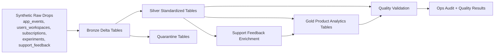

# Architecture

## Overview
This project uses a bronze/silver/gold lakehouse layout optimized for Databricks Free Edition:

- raw CSV drops are checked into the repo for deterministic local and workspace runs
- bronze stores raw records plus ingestion metadata
- silver applies contracts, dedupe, normalization, and PII minimization
- gold publishes product analytics and support-topic metrics
- audit and quality tables capture operational metadata

## Architecture Diagram

## Databricks Design Choices
- use notebooks plus reusable Python modules instead of notebook-only logic
- use `MERGE` for silver and gold rerun safety
- keep data volumes small so the whole project fits within Free Edition quotas
- use a mock LLM provider by default so the platform is runnable with no secrets
